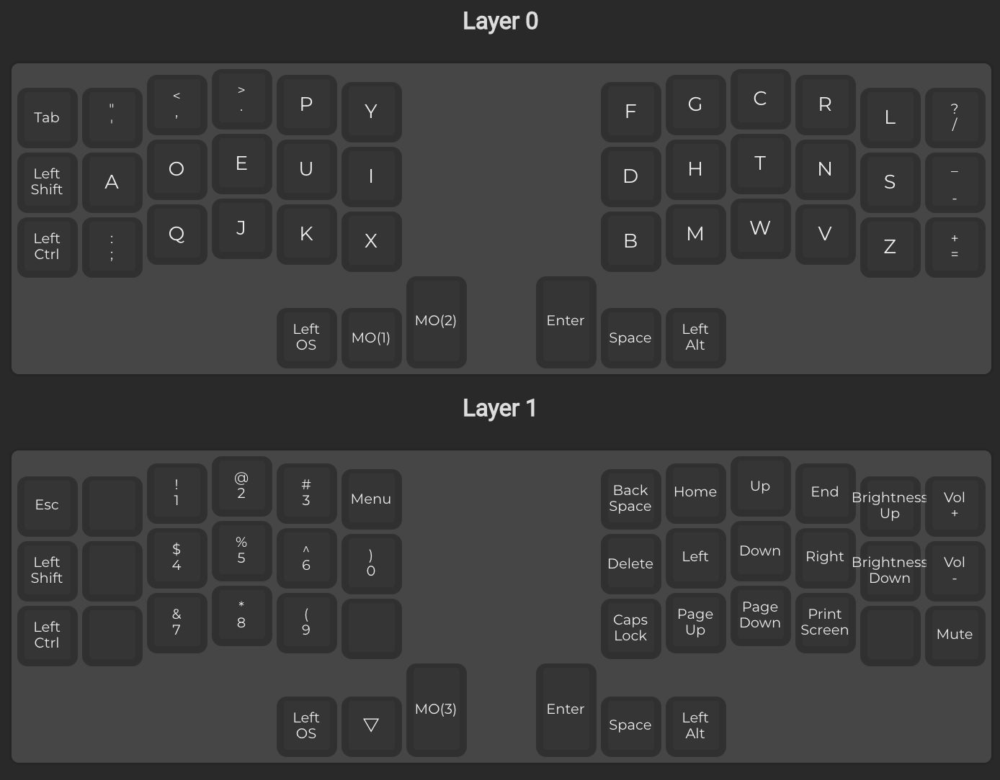
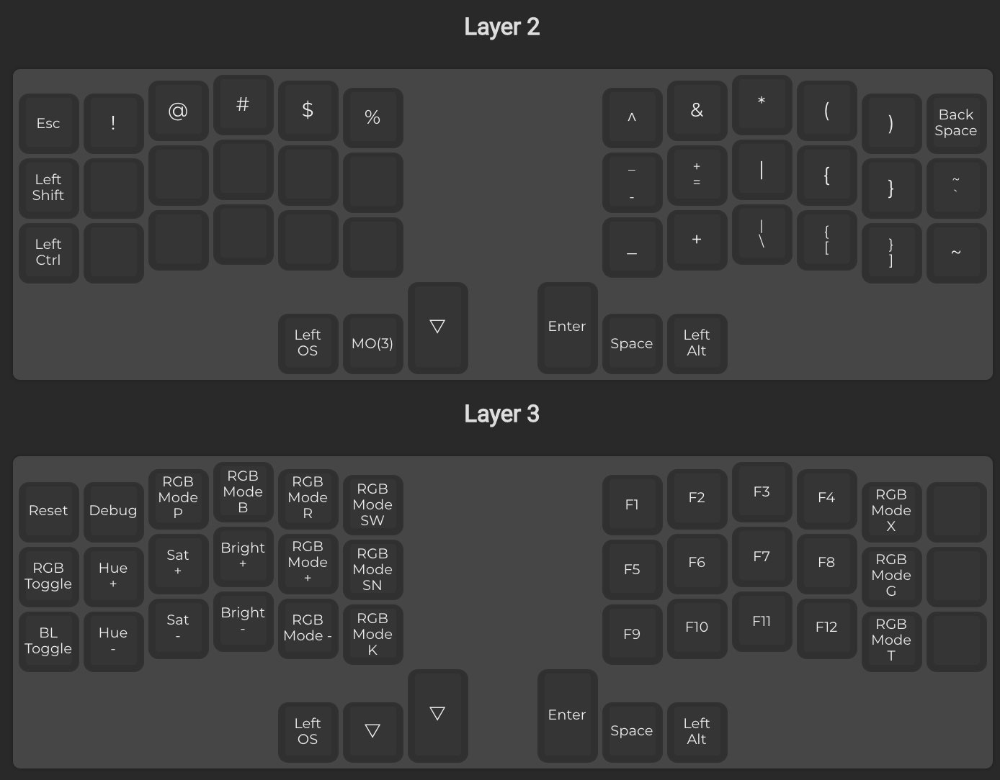

# Corne keyboard Dvorak layout

# Flash

* Move the `config.h`, `keymay.c` and `rules.mk` files to `~/qmk_firmware/keyboard/crkbd/keymaps/default`.

* Run the command `qmk flash -kb crkbd -km default`. You need to flash both sides

The right side is the `master`

# Layers

